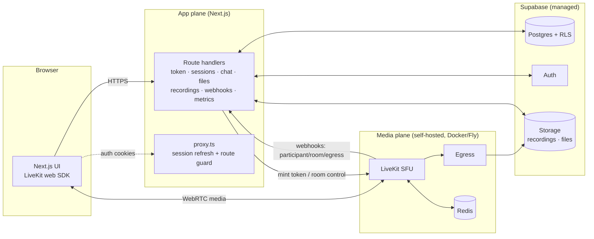
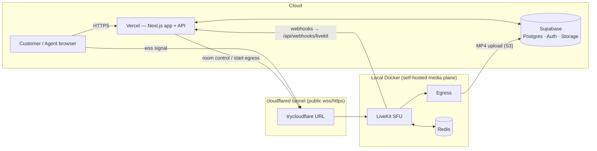
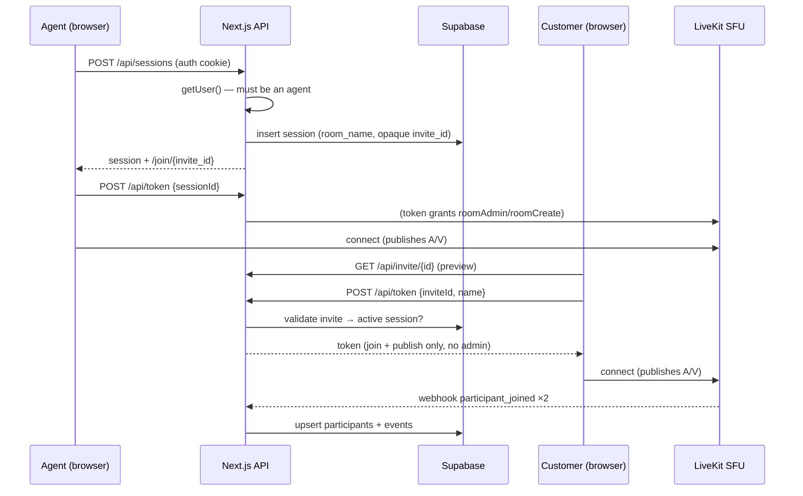

# ClariVue — Architecture

Self-hosted, real-time video support platform. This document covers the system design, the data
model, the security model, and a requirement-by-requirement traceability matrix.

---

## 1. System overview

ClariVue separates two planes:

- **App plane** — the Next.js application: UI (React + `@livekit/components-react`) *and* the app
  backend as App-Router **route handlers**. It mints LiveKit tokens, enforces roles, and persists
  everything to Supabase. Stateless and serverless-friendly.
- **Media plane** — a **self-hosted LiveKit SFU** (+ Egress + Redis). All audio/video flows through
  it; clients never connect peer-to-peer and we never use a third-party hosted video API. This is
  the hard constraint of the brief, and the reason media lives in its own plane: WebRTC needs
  UDP/TCP traffic that has no business touching the app server.

### Why this split (and why not Railway)
A WebRTC SFU needs a wide UDP port range + a stable IP. Railway/Render/Heroku only route HTTP/TCP,
so the media plane runs on infrastructure that exposes raw UDP/TCP (locally: Docker; for a stable
public deployment: a VM with a dedicated IP). The app backend needs no UDP, so it lives as Next.js
route handlers co-located with the UI — no separate API service to operate. Locally everything is
`localhost`; on Docker Desktop, clients use LiveKit's **ICE/TCP fallback** (port 7881) because the
container's UDP candidates aren't reachable across the Docker VM boundary.

### Deployment (live)
The live app runs at **https://clari-vue.vercel.app**: the Next.js app is on **Vercel**, the database/
auth/storage on **Supabase** cloud, and the self-hosted **LiveKit + Egress + Redis** run in local
Docker, exposed to the cloud through a **cloudflared tunnel** (so media still flows through *our own*
SFU — never a third-party hosted video API). `NEXT_PUBLIC_LIVEKIT_URL` (wss → the tunnel) is the
browser signal URL; `LIVEKIT_URL` (https → the tunnel) is the server SDK URL; LiveKit posts webhooks
back to the public Vercel URL.

> **Operational note:** `trycloudflare` quick tunnels are ephemeral. If the tunnel drops, restart it,
> update `LIVEKIT_URL` + `NEXT_PUBLIC_LIVEKIT_URL` on Vercel, and redeploy (the public URL is inlined
> at build time). A named Cloudflare tunnel or a public-IP VM removes this fragility. See
> [`WORKFLOW.md`](./WORKFLOW.md) §10.

---

## 2. Key flows

### Create + join a session

### Token minting — the single enforcement point (R13–R15)
All role logic lives in `POST /api/token`:
- **Agent path:** requires a Supabase-verified user who owns the session (or admin) → grants
  `roomAdmin` + `roomCreate`.
- **Customer path:** requires a valid, **active** invite that maps to the room → grants `roomJoin`
  + publish/subscribe only. No admin grants. Identity is namespaced (`customer-…`) so it can never
  impersonate an agent.

Privileged routes (`/api/sessions` POST, `/end`, `/recordings/*`, `/admin/*`) independently verify
`getUser()` and ownership. Client-side guards (`proxy.ts`, redirects) are UX only.

### Recording lifecycle (R16)
`recordings/start` → `EgressClient.startRoomCompositeEgress` → row `in_progress`. `recordings/stop`
→ `stopEgress` → `processing`. The signed LiveKit `egress_ended` webhook → `ready`. The UI pill
reflects each transition; download is a short-lived signed Storage URL.

---

## 3. Data model (Supabase Postgres)

`profiles · sessions · session_participants · session_events · chat_messages · shared_files ·
recordings` (see `supabase/migrations/0001_init.sql`).

- `sessions` carry a unique `room_name` and an opaque `invite_id`.
- `session_participants` track presence with `joined_at` / `left_at` / `disconnected_at` /
  `reconnect_count` (the reconnect grace window).
- `session_events` is an append-only log (joins, leaves, room/egress lifecycle) → queryable history.

### Security model
- **RLS is on for every table.** Authenticated agents can read only their own sessions and children
  (`agent_id = auth.uid()`); admins read all (`is_admin()`).
- **Customers are anonymous** — they never use a Supabase client key for privileged data. Every
  customer read/write (join, chat, file upload) goes through a **server route** that validates the
  invite and then uses the **service key** (which bypasses RLS). This keeps the browser locked by
  default while letting validated customers participate.
- Auth/token routes are `dynamic = 'force-dynamic'` + `Cache-Control: no-store` (never cache a
  `Set-Cookie` or a per-user token). The service key is server-only, never `NEXT_PUBLIC_`.
- LiveKit webhooks are verified with `WebhookReceiver` (unsigned requests rejected). Invite ids are
  unguessable random tokens. File uploads are mime/size-checked, stored per-session, served via
  signed URLs.

---

## 4. Caching

A cache-aside layer over **Upstash Redis (HTTP)** sits in front of hot reads (invite validation,
admin live snapshot, recording status, metrics, chat hydrate). It is **optional** — when the
`UPSTASH_*` env vars are absent the helper transparently falls through to the source, so local dev
is zero-config. All invalidation funnels through the LiveKit webhook handler (the single place room
state changes), so the cache can't silently drift. Authenticated/token responses are never cached.

---

## 5. Requirements traceability

| # | Requirement | Type | Where | Status |
|---|---|---|---|---|
| R1 | Agent creates session, invite link/token | MH | `POST /api/sessions`, `/join/[inviteId]` | ✅ verified |
| R2 | Both join from browser, no install | MH | Next.js + LiveKit web SDK | ✅ verified |
| R3 | Track who's in a session at any time | MH | `session_participants` + webhooks | ✅ verified |
| R4 | Either party ends; connections closed | MH | `/api/sessions/[id]/end` → `deleteRoom` | ✅ |
| R5 | Session history persisted & queryable | MH | `sessions`, `session_events`, record view | ✅ verified |
| R6 | Real-time A/V both directions | MH | LiveKit SFU | ✅ verified (2-browser test) |
| R7 | Media routes through server, no P2P | MH | self-hosted LiveKit SFU | ✅ verified |
| R8 | Stable under normal network | MH | ICE/TCP fallback on :7881 | ✅ |
| R9 | Mute audio / disable video anytime | MH | control bar | ✅ |
| R10 | In-call text chat, real-time | MH | LiveKit data channel | ✅ verified |
| R11 | Chat persisted | MH | `chat_messages` via `/api/chat` | ✅ verified |
| R12 | Chat retrievable after call | MH | `GET /api/chat`, session record | ✅ verified |
| R13 | Role: Agent (create/end/record) | MH | token grants + route checks | ✅ verified |
| R14 | Role: Customer (join by invite only) | MH | invite validation, no admin grants | ✅ verified |
| R15 | Access enforced server-side | MH | `getUser()` in privileged routes | ✅ verified |
| R16 | Recording: start/stop, status, download | B | Egress + `recordings` + signed URL | ✅ built (needs S3 keys to capture) |
| R17 | File sharing in chat | B | Storage + `shared_files` + signed URLs | ✅ verified |
| R18 | Reconnect grace, silent re-entry | B | `disconnected_at` + grace in webhook | ✅ built |
| R19 | Admin dashboard: live, history, force-end | B | `/admin` + `RoomServiceClient` | ✅ verified |
| R20 | Observability metrics | B | `/api/metrics` (Prometheus) | ✅ verified |

MH = must-have, B = bonus. "verified" = exercised by an automated two-browser test or a direct check
(see `scripts/`).

---

## 6. Technology choices

| Layer | Choice | Why |
|---|---|---|
| Frontend + App API | Next.js 16 (App Router, TS) | One codebase for UI + backend route handlers |
| Media SFU | self-hosted LiveKit | OSS, server-routed media, token-based roles, webhooks, egress, metrics |
| Recording | LiveKit Egress → Supabase Storage | OSS room-composite MP4 |
| Auth | Supabase Auth | agents only; instant signups for the demo |
| Database | Supabase Postgres + RLS | sessions, presence, chat, files, recordings |
| Storage | Supabase Storage | private buckets, signed URLs |
| Cache | Upstash Redis (optional) | serverless-safe hot-read cache |
| Local dev | Docker Compose | LiveKit + Egress + Redis identical to prod |
| Metrics | Prometheus (`prom-client` + LiveKit native) | standard scrape format |
