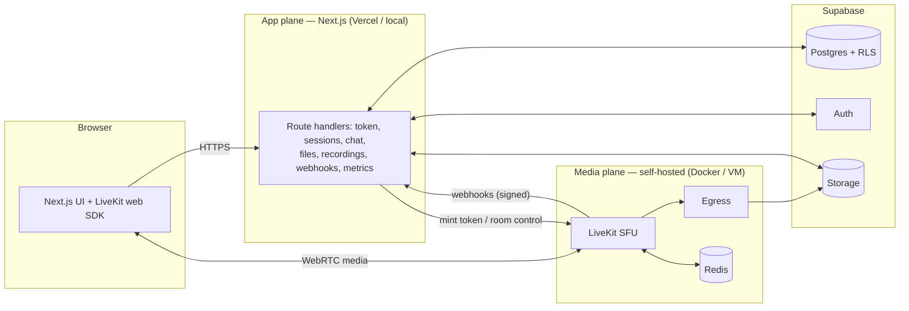

# ClariVue — Workflow, Setup & System Design

<p align="center">
  
</p>

<p align="center"><b>Real-time, self-hosted video support platform</b> · Built for the AtomQuest Hackathon 1.0 Grand Finale</p>

This document is the single operator-facing guide: what the system is, how it maps to the problem
statement, how it's architected, and exactly how to install, run, test, and deploy it.

---

## 1. The problem & the solution

Support teams resolve simple issues over voice, but go blind the moment a problem needs to be
*seen* — a field engineer at a device, an agent walking a customer through a UI. ClariVue adds a
real-time **video** layer that the support team **owns and operates entirely**: an agent creates a
session, invites a customer by link, both join from the browser onto audio/video routed through our
**own media server**, they chat and share files, the agent can record, and every session is
persisted and reviewable.

The brief's hard constraints — browser-only, **media through our own server (no P2P, no third-party
hosted video API)**, two enforced roles, a complete end-to-end demo — are all satisfied by
self-hosting a **LiveKit** SFU that we run ourselves and point clients at directly.

---

## 2. Problem-statement requirement coverage

| Area | Requirement | How ClariVue does it |
|------|-------------|----------------------|
| **Session management** | Agent creates session + invite link | `POST /api/sessions` → row with unique `room_name` + opaque `invite_id`; share `/join/{invite_id}` |
| | Both join from browser, no install | Next.js + LiveKit web SDK |
| | Track who's in a session | `session_participants` updated by signed LiveKit webhooks |
| | Either party ends; connections closed | `POST /api/sessions/[id]/end` → `RoomServiceClient.deleteRoom` |
| | History persisted & queryable | `sessions` + `session_events` (append-only log) + session record view |
| **Audio & video** | Both see/hear in real time | LiveKit SFU |
| | Media routes through server (no P2P) | self-hosted LiveKit SFU — server-routed by design |
| | Stable under normal network | ICE/TCP fallback on :7881 |
| | Mute audio / disable video anytime | in-call control bar |
| **In-call chat** | Real-time text | LiveKit data channel |
| | Persisted | `chat_messages` via `/api/chat` |
| | Retrievable after call | `GET /api/chat` + session record |
| **Roles & access** | Agent: create/end/record | Supabase auth + token grants `roomAdmin`/`roomCreate` |
| | Customer: join by invite only | invite validated server-side; join + publish only, no admin |
| | Access enforced server-side | `getUser()` checked in every privileged route |
| **Bonus** | Recording (start/stop/status/download) | LiveKit Egress → Supabase Storage; status pill + signed URL |
| | File sharing in chat | server-mediated upload → Storage → in-chat card + record |
| | Reconnect grace | `disconnected_at` + 30s window + suppressed re-join in webhook |
| | Admin dashboard | `/admin` live sessions + participants + force-end + history |
| | Observability | `/api/metrics` Prometheus exposition |

---

## 3. System architecture

ClariVue separates an **app plane** (stateless, serverless-friendly) from a **media plane**
(self-hosted, needs raw UDP/TCP). The app never proxies media; LiveKit never holds business state.



**Why the split (and why not Railway):** a WebRTC SFU needs a wide UDP range + a stable IP, which
HTTP-only PaaS (Railway/Render) can't provide. So the media plane runs on infrastructure that
exposes UDP (locally: Docker; in production: a VM/Fly with a dedicated IP). The app backend needs no
UDP and lives as Next.js route handlers co-located with the UI.

**Roles are enforced at one choke point** — `POST /api/token`:
- *Agent* (Supabase-verified owner/admin) → grants `roomAdmin` + `roomCreate`.
- *Customer* (valid active invite) → `roomJoin` + publish/subscribe only; identity namespaced
  `customer-…` so it can't impersonate an agent.

**Security:** RLS on every table; anonymous customers reach data only through invite-validated
server routes using the service key; auth/token routes are `no-store`; webhooks verified with
`WebhookReceiver`; uploads mime/size-checked + signed URLs; service key server-only.

Full design + the R1–R20 traceability matrix: [`ARCHITECTURE.md`](./ARCHITECTURE.md).

---

## 4. Tech stack

| Layer | Technology |
|-------|------------|
| Frontend + app API | Next.js 16 (App Router, TypeScript), React 19 |
| UI | Tailwind CSS v4, `@livekit/components-react`, lucide-react |
| Media SFU | self-hosted LiveKit (+ Egress for recording) |
| Realtime/reconnect cache | Redis |
| Auth | Supabase Auth (agents) |
| Database | Supabase Postgres (RLS) |
| Object storage | Supabase Storage (recordings + files) |
| App cache (optional) | Upstash Redis (HTTP) |
| Metrics | Prometheus (`prom-client` + LiveKit native) |
| Local dev | Docker Compose (LiveKit + Egress + Redis) |
| Tests | Playwright (two-browser fake-media e2e) |

---

## 5. Prerequisites

- **Node.js** 20.9+ (developed on Node 26)
- **Docker Desktop** (for the local media plane)
- A **Supabase** project (free tier) — provides Postgres, Auth, Storage
- **npm** (pnpm optional; this repo uses npm)

---

## 6. Install

```bash
git clone https://github.com/Gurjas2112/ClariVue.git
cd ClariVue

# root tooling (db scripts, e2e tests)
npm install

# web app
cd apps/web && npm install && cd ../..
```

---

## 7. Run locally (three steps)

### 7.1 Media plane (Docker)
```bash
cd infra
docker compose up -d        # redis + LiveKit SFU
# recording (optional): add Supabase S3 keys, then:
# SUPABASE_S3_ACCESS_KEY=... SUPABASE_S3_SECRET_KEY=... docker compose --profile recording up -d
cd ..
```

### 7.2 Database (apply schema + buckets)
```bash
# session-pooler URL from Supabase → Project Settings → Database → Connection string
DB_URL="postgresql://postgres.<ref>:<password>@<region>.pooler.supabase.com:5432/postgres" \
  npm run db:apply
```
(Or paste `supabase/migrations/0001_init.sql` then `supabase/seed.sql` into the Supabase SQL editor.)

### 7.3 App
```bash
cp apps/web/.env.example apps/web/.env.local     # fill Supabase keys; LiveKit defaults are local
cd apps/web

npm run dev                 # http://localhost:3000  (dev: compiles routes on demand)
# — or, for a snappy demo (recommended) —
npm run build && npm start  # precompiled, instant routes
```

> On Windows/OneDrive the dev server compiles each route on first hit (slow I/O). The production
> server (`build && start`) avoids this — it's what the demo and tests were validated against.

---

## 8. Verify (automated)

Two-browser fake-media end-to-end checks (no manual clicking needed), run against a server on `:3000`:
```bash
node scripts/media-gate-test.mjs   # SFU media both ways + real-time chat + file sharing
node scripts/admin-test.mjs        # admin access control + dashboard render
```

---

## 9. Demo script

1. Log in as the agent → **Start support session** → copy the invite link.
2. Open the link in a second browser/incognito → enter a name → **Join the call**. Both see & hear.
3. Toggle mute / camera; share your screen.
4. Exchange a chat message; share an image/PDF (appears as a card both sides).
5. *(Recording enabled)* agent hits **Record** → pill goes live → **Stop** → Processing → Ready → download.
6. Open `/admin` (as admin) → see the live session → **Force end**.
7. Agent ends the call → open the session record → chat transcript, shared file, participants, events.

**Demo credentials:** agent `agent@clarivue.demo` / `clarivue123` · admin `admin@clarivue.demo` /
`clarivue123` · ready invite `/join/demo-call`.

---

## 10. Deployment

**Live app: https://clari-vue.vercel.app** — Next.js app on **Vercel**, database/auth/storage on
**Supabase** cloud, and the self-hosted **LiveKit + Egress + Redis** in local Docker exposed to the
cloud through a **cloudflared tunnel** (media stays on our own SFU — no third-party hosted video).

**Deploy steps**
```bash
# 1. expose the local SFU publicly (keep running)
cloudflared tunnel --url http://localhost:7880          # → https://<name>.trycloudflare.com
# 2. set Vercel env (production): Supabase keys + S3 keys, plus:
#    LIVEKIT_URL = https://<name>.trycloudflare.com   NEXT_PUBLIC_LIVEKIT_URL = wss://<name>.trycloudflare.com
# 3. deploy apps/web (set the project Root Directory to apps/web)
cd apps/web && vercel --prod
```

**⚠️ Tunnel recovery (do this if live video/recording stops).** `trycloudflare` quick tunnels are
ephemeral and drop. `NEXT_PUBLIC_LIVEKIT_URL` is inlined at build time, so the new URL needs a
redeploy:
```bash
# 1. restart tunnel → new https URL
cloudflared tunnel --url http://localhost:7880
# 2. update BOTH urls on Vercel (production)
cd apps/web
vercel env rm LIVEKIT_URL production --yes;            echo "https://<new>.trycloudflare.com" | vercel env add LIVEKIT_URL production
vercel env rm NEXT_PUBLIC_LIVEKIT_URL production --yes; echo "wss://<new>.trycloudflare.com"   | vercel env add NEXT_PUBLIC_LIVEKIT_URL production
# 3. redeploy
vercel --prod
```
Keep `docker compose -f infra/docker-compose.yml --profile recording up -d` running (LiveKit + Egress
+ Redis) the whole time — recording needs the local Egress container. For a hands-off demo, use a
**named Cloudflare tunnel** (stable URL on your domain) or a **public-IP VM** for LiveKit.

---

## 11. Known limitations

- Single-node LiveKit (no horizontal SFU scaling) — fine for the demo and many small concurrent calls.
- On Docker Desktop, media uses ICE/TCP fallback (:7881); slightly higher latency, rock-solid for localhost.
- Recording requires the egress profile + Supabase S3 keys (one dashboard step).
- Reconnect grace window fixed at 30s.
- Live video on a cloud-hosted app requires a publicly reachable self-hosted LiveKit (see §10).

---

## 11½. Email confirmation & SMTP

Agent signup requires email confirmation. Supabase sends a confirmation link via **custom Gmail
SMTP** — configured server-side on the Supabase project, never stored in git.

### How it works

1. Agent fills out `/signup` → `POST /api/auth/signup` calls `supabase.auth.signUp()`.
2. Supabase sends a confirmation email from `ClariVue <gsgbmcc@gmail.com>` via Gmail SMTP.
3. Agent clicks the link → redirected to `/auth/callback` → code exchanged for session → dashboard.

### Current SMTP config (set via Supabase Management API)

| Setting | Value |
|---------|-------|
| Host | `smtp.gmail.com` |
| Port | `587` (STARTTLS) |
| Username | `gsgbmcc@gmail.com` |
| Sender name | ClariVue |
| Auth | Google App Password (16-char, not the Gmail login password) |

### Reconfiguring SMTP

**Option A — Supabase Dashboard:**
Project → Authentication → SMTP Settings → Enable Custom SMTP → fill in the fields.

**Option B — Management API** (what we used):
```bash
curl -X PATCH "https://api.supabase.com/v1/projects/<ref>/config/auth" \
  -H "Authorization: Bearer <supabase-access-token>" \
  -H "Content-Type: application/json" \
  -d '{"smtp_host":"smtp.gmail.com","smtp_port":"587",
       "smtp_user":"you@gmail.com","smtp_pass":"<app-password>",
       "smtp_admin_email":"you@gmail.com","smtp_sender_name":"ClariVue"}'
```

### Generating a Google App Password

1. Go to [myaccount.google.com/apppasswords](https://myaccount.google.com/apppasswords)
2. Select **Mail** → generate → copy the 16-character password
3. Use this as `smtp_pass` — never your regular Gmail password

---

<p align="center">
  <br/>
  <b>Gurjas Gandhi</b> · ClariVue
</p>
